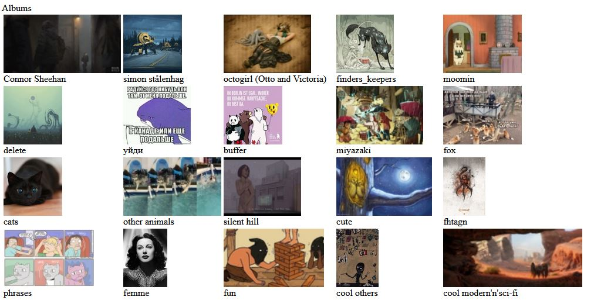
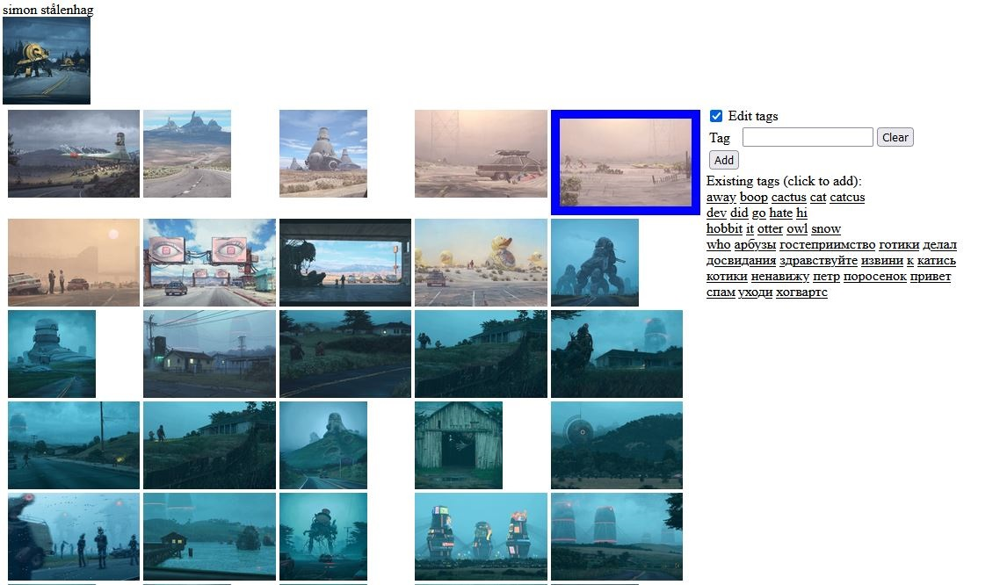
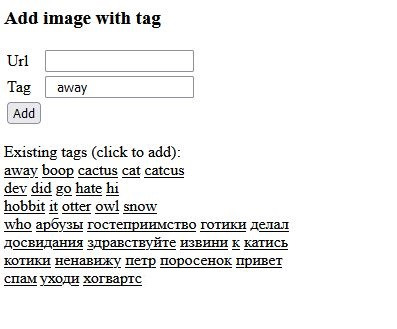
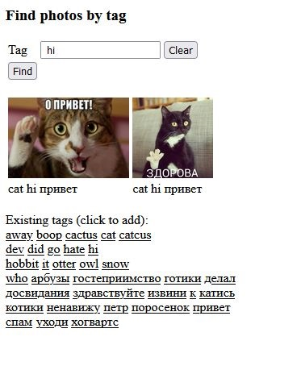

# VK Media

Web service providing an ability to:
 - add tags for your images in VK; 
 - ~~add tags to any images on the internet~~(disabled at the moment)
 - look for the images by tags.

VK is a social network (https://vk.com/) with a massive media support 
like storing and sharing of images, music, video.

Consists of 2 microservices:
 - VK Media service - works with VK
 - Tagged Image service - works with DB, provides lists of available tags and images by tags

## Context
1. [VK Media UI](#vk-media-ui)
1. [VK Media REST](#vk-media-rest)
   1. [Add photo with tags](#vk-media-add-photo)
1. [Tagged Image UI](#tagged-image-ui)
1. [Tagged Image REST](#tagged-image-rest)
   1. [Add photo with tags](#tagged-image-add-photo)
   1. [Get Existing tags](#tagged-image-get-tags)
   1. [Get Photos by Tags](#tagged-image-get-photos-by-tags)
   1. [Get Photos by Ids](#tagged-image-get-photos-by-ids)
   1. [Get Photos by Album and VK photo ids](#tagged-image-get-photos-by-vk-ids)
1. [Mobile App](#mobile)   
1. [Useful test links](#test)

## VK Media UI

### Main page
initial page with VK auth and link to VK photo albums after the successful auth:  
https://vk-media-prod-vk-media-3oqoex.mo2.mogenius.io
   
### User Albums

The list of user VK albums

   
### Album page
Album images page with an ability to add tags  

Image tags information is stored in Mongo DB and also in the description of the photo in VK

## VK Media REST

### Add photo with tags
Used by album page to add tags to the selected image via AJAX.  
Requires VK auth both for work and outside access prohibition

`POST /photos/addPhotoWithTagRest`

#### Request

    curl --location --request POST 'http://localhost:8080/photos/addPhotoWithTagRest' \
    --header 'Content-Type: application/json' \
    --data-raw '{
       photoVkId: {photoVkId},
       albumId: {albumId},
       tags: {tag}
    }'
   
## Tagged Image UI

### Add image with tag:

~~https://tagged-image-prod-vk-media-3oqoex.mo2.mogenius.io/photos/addPhotoWithTag~~

__Disabled at the moment__

   
### Find photos by tag:  

https://tagged-image-prod-vk-media-3oqoex.mo2.mogenius.io/photos/findPhotosByTag

   
##  Tagged Image REST

### Add photo with tags  
   Used by _VK Media_ to set or update tags to the selected image. 
   Requires __token__ for outside access prohibition. 
   __Token__ is taken from the service environment variables

   `PUT /photos/putPhotoWithTagRest`
   
#### Request

    curl --location --request PUT 'http://localhost:8282/photos/putPhotoWithTagRest?token={token}' \
    --header 'Content-Type: application/json' \
    --data-raw '{
       photoVkId: {photoVkId},
       albumId: {albumId},
       tags: {tag}
    }'
   
### Get Existing tags  

`GET /photos/getExistingTagsRest`

#### Request

    curl --location --request GET 'http://localhost:8282/photos/getExistingTagsRest'

#### Response

    [
      "away",
      "cat"
    ]

### Get Photos by Tags

`GET /photos/getPhotosByTagRest`

#### Request

    curl --location --request GET 'http://localhost:8282/photos/getPhotosByTagRest?tags=cat'

#### Response

    [
       {
           "id": "62ae2e49340fc2aa4f29461b",
           "vkId": null,
           "albumId": 123123,
           "previewPhotoURI": "https://sun9-32.userapi.com/impf/tvia2JFbcot4B-tQ31KVwQEzNwWMt4VGkWA3sQ/vLJg8Zk1g_E.jpg?size=1200x1105&quality=95&sign=23c9728ebd3eba8aaaf18879ae9e3161&type=album",
           "photoURI": "https://sun9-32.userapi.com/impf/tvia2JFbcot4B-tQ31KVwQEzNwWMt4VGkWA3sQ/vLJg8Zk1g_E.jpg?size=1200x1105&quality=95&sign=23c9728ebd3eba8aaaf18879ae9e3161&type=album",
           "tags": "cat"
       }
    ]

### Get Photos by Ids

`GET /photos/getPhotosByIdsRest`

#### Request

    curl --location --request GET 'http://localhost:8282/photos/getPhotosByIdsRest' \
    --header 'Content-Type: application/json' \
    --data-raw '[
       "62ae2e49340fc2aa4f29461b",
       "62ae4d14d9b4e109cbd76637"
    ]'

#### Response

    [
       {
          "id": "62ae2e49340fc2aa4f29461b",
          "vkId": null,
          "albumId": 123123,
          "previewPhotoURI": "https://sun9-32.userapi.com/impf/tvia2JFbcot4B-tQ31KVwQEzNwWMt4VGkWA3sQ/vLJg8Zk1g_E.jpg?size=1200x1105&quality=95&sign=23c9728ebd3eba8aaaf18879ae9e3161&type=album",
          "photoURI": "https://sun9-32.userapi.com/impf/tvia2JFbcot4B-tQ31KVwQEzNwWMt4VGkWA3sQ/vLJg8Zk1g_E.jpg?size=1200x1105&quality=95&sign=23c9728ebd3eba8aaaf18879ae9e3161&type=album",
          "tags": "cat"
       },
       {
          "id": "62ae4d14d9b4e109cbd76637",
          "vkId": null,
          "albumId": 0,
          "previewPhotoURI": null,
          "photoURI": "https://sun9-86.userapi.com/impf/AfsvcKyk1gnnavNb6hWjwg18eeDDw5dHrfvIiA/c0Vn5XkmYVk.jpg?size=200x200&quality=96&sign=892de7a8a9b9bbebdc38cf38b9e37092&type=album",
          "tags": "уходи cat"
       }
    ]

### Get Photos by Album and VK photo ids

   Used by _VK Media_ to get stored tags for the certain images to compare with the tags stored in VK and merge in case of any discrepancy

`POST /photos/getPhotosByAlbumAndVkIdsRest`

#### Request

    curl --location --request POST 'http://localhost:8282/photos/getPhotosByAlbumAndVkIdsRest' \
    --header 'Content-Type: application/json' \
    --data-raw '{"vkIds":["302364637"],"albumId":238605734}'

#### Response

    [
       {
           "id": "62ddc84f18ebd65a99138fe3",
           "vkId": "302364637",
           "albumId": 238605734,
           "previewPhotoURI": "https://sun9-86.userapi.com/impf/AfsvcKyk1gnnavNb6hWjwg18eeDDw5dHrfvIiA/c0Vn5XkmYVk.jpg?size=200x200&quality=96&sign=892de7a8a9b9bbebdc38cf38b9e37092&c_uniq_tag=JfIHjzYonFudDn1tZF7OaJVH15nN18sTPKZe30zDACQ&type=album",
           "photoURI": "https://sun9-86.userapi.com/impf/AfsvcKyk1gnnavNb6hWjwg18eeDDw5dHrfvIiA/c0Vn5XkmYVk.jpg?size=200x200&quality=96&sign=892de7a8a9b9bbebdc38cf38b9e37092&c_uniq_tag=JfIHjzYonFudDn1tZF7OaJVH15nN18sTPKZe30zDACQ&type=album",
           "tags": "cat уходи"
       }
   ]

## Mobile app

[Google Play](https://play.google.com/store/apps/details?id=com.guiess.gr_media_app)  
[AppStore](https://apps.apple.com/us/app/gr-media/id1634495080)

## Useful test links

test with sample docker containers  
https://www.testcontainers.org/quickstart/junit_5_quickstart/  
https://www.baeldung.com/spring-boot-testcontainers-integration-test
